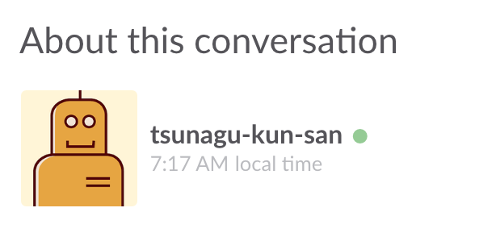

# tsunagu-kun

## 1.tsunagu-kunとは？？
tsunagu-kunはLineとSlackという異なるアプリケーション間でコミュニケーションを可能にするBOTである。Slack側のBOTはtsunagu-kun-sanで、Line側のBOTはtsunagu-kun-chanである。このBOTを使うことによってLine→Slackにメッセージを送ったり、Slack→Lineにメッセージを送ったり、またメンションをつけることによって任意のユーザにメッセージを送ることが出来る。

|Slack||Line|
|:-:|:-:|:-:|
||⇔||
|**tsunagu-kun-san(Slack BOT)**||**tsunagu-kun-chan(Line BOT)**|
||⇔||

## 2.用意するもの
* slack
* line
* コミュ力(無くても良い)

## 3.使用手順
* 3.1. slackのチャンネルにtsunagu-kun-sanを招待
* 3.2. 会員登録をする(slackによるDM)
* 3.3. 会員認証をする(Lineで友達登録してslackで受け取ったuser_id/passを入力する)
* 3.4. 認証が取れたと出れば準備完了！

### 3.1. Slackのチャンネルにtsunagu-kun-sanを招待
  

tsunagu-kun-sanをSlackのchannelに招待し、Active(◯が緑色)になっていることを確認する

### 3.2. 会員登録をしよう！
Slackでtsunagu-kun-sanにダイレクトメッセージを送ろう！
送るメッセージはなんでもOK！メッセージを送るとtsunagu-kun-sanからメッセージが送られてきて、user名と認証用のpassが送られてきます。
  

### 3.3. line側で会員認証をしよう！
slackで送られてきた[リンク](https://line.me/R/ti/p/%40vih9944f)をクリックして以下のQRコードから友だち追加をします。  

  

↑tsunagu-kun-chan登録用QRコード  

  

Lineでtsunagu-kun-chanを友達に追加するか聞かれるので"追加"をタップする。

すると以下のようなメッセージが来るので先程Slackから送られてきたユーザ名とパスワードを入力します。  

### 3.4. 認証が取れたと出れば準備完了
  

user名とパスワードが一致すると"認証がとれた"のメッセージが出るので成功！

## 4.tsunagu-kunを使用する
||tsunagu-kunでできること|
|:-:|:--|
|4.1|slack->lineへメッセージを送る|
|4.2|line->slackへメッセージを送る|
|4.3|メンションを使ってslackから任意のユーザにLineメッセージを送る|
|4.4|LineからSlackへメンションをつけて送る|
|4.5|Lineでメンションで送れる一覧を表示|

### 4.1. slack->lineへメッセージを送る
まずはSlackからLineへメッセージを送ろう！  

Slackで好きな言葉を発してみよう！  

  

するとline側にtsunagu-kun-chanからメッセージが届きます！  
  

### 4.2. line->slackへメッセージを送る
次にLineからSlackへメッセージを送ろう！

Lineで好きな言葉を発してみよう！  

  

するとSlack側にtsunagu-kun-sanからメッセージが届きます！

  

### 4.3. メンションを使ってslackから任意のユーザにLineメッセージを送る
  

Slackからメンション付きでメッセージを送ってみよう!
@usernameでメンション付きメッセージを送れます！

  

するとメンションの付いたユーザにだけLineにメッセージを送ります。
またメンションがついていることがわかるように＠ユーザ名がメッセージの最初に付与されます。

### 4.4. LineからSlackへメンションをつけて送る
  

Lineからメンション付きでメッセージを送ってみよう！
@usernameでメンション付きメッセージを送れます！  

するとslack側でメンションがついてメッセージが送られてきます。

### 4.5. Lineでメンションで送れる一覧を表示
  

tsunagu-kun-chanに"@"というメッセージを送るとメンションを送れるユーザの一覧が取得できます

## 5. 退会
tsunagu-kunから情報を受け取りたくなくなったらLine側でブロックすることによって完全に退会することが出来ます。データベースの認証情報も全て削除されます

## 6. 再会員登録
Lineでtsunagu-kunのブロックを解除して再び3.の手順を踏むと再びtsunagu-kunから情報を受け取れるようになります。
